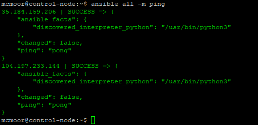
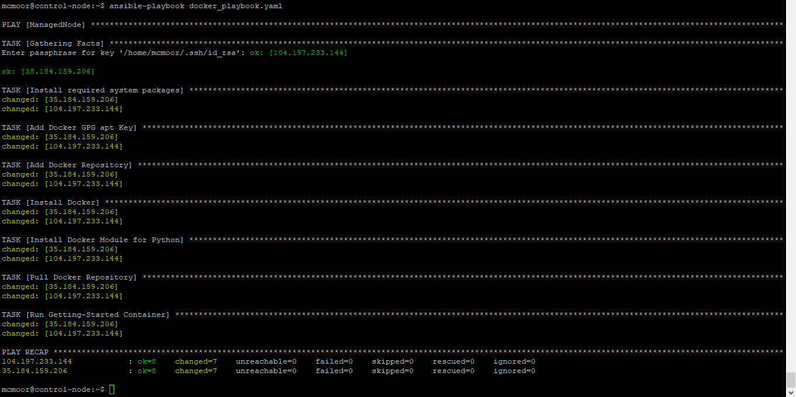
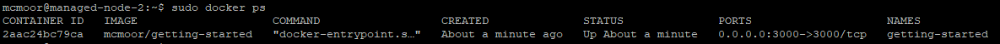

# Chapter 2 : Ansible

## Daftar Isi

* [Chapter 0 : Konfigurasi Mesin](articles/machine.md)
* [Chapter 1 : Docker](articles/docker.md)
* [Chapter 2 : Ansible](articles/ansible.md)
* [Chapter 3 : Kubernetes](articles/kubernetes.md) 

Ansible adalah sebuah tool untuk melakukan otomasi manajemen berbagai server. Tool ini ditulis berdasarkan Python dan melakukan koneksi berbasis SSH. Dengan tool ini, maka pengguna dapat mengotomasi beberapa script yang mungkin akan dijalankan kepada beberapa mesin sekaligus.

Keunggulan dari Ansible untuk proses deployment adalah:
* Ansible tidak memerlukan instalasi agent pada mesin target karena Ansible menggunakan protokol SSH untuk komunikasi.
* Ansible Playbook dapat digunakan untuk menyatukan seluruh script dalam file YAML yang lebih mudah digunakan dan dibaca dari JSON.
* Ansible sangat mudah digunakan baik untuk mesin yang sedikit atau banyak. Dengan kata lain, Ansible memiliki scalability yang tinggi.

Sedangkan kekurangan dari Ansible adalah:
* Modul Ansible sederhana dan mudah digunakan namun juga tidak dapat menangani perintah yang sangat kompleks.
* Ansible tidak memiliki support yang baik terhadap Windows. Ansible juga tidak memiliki GUI yang memiliki semua fitur karena Ansible utamanya adalah tool untuk command-line
* Ansible tidak menyimpan state sehingga tidak dapat mengecek dependensi. Oleh karena itu, Ansible hanya dapat melakukan perintah secara sekuensial dari awal sampai akhir atau gagal 

Pada kesempatan ini, kita akan membuat sebuah script Ansible yang dapat memanipulasi beberapa mesin kosong sehingga dapat mengeksekusi web app To-Do App yang sudah dibuat sebelumnya.

## Part 0. Instalasi Ansible

Ansible membagi beberapa mesin menjadi **Control Node** dan **Managed Node**. **Control Node** bertugas untuk menjadi basis dari Ansible untuk memanipulasi semua **Managed Node**. Untuk itu, Ansible cukup hanya diinstall dalam **Control-Node**.

Untuk melakukan instalasi Ansible, masukan perintah berikut ini

    $ sudo apt update
    $ sudo apt install software-properties-common
    $ sudo add-apt-repository --yes --update ppa:ansible/ansible
    $ sudo apt install ansible

Ansible menggunakan SSH sebagai basis untuk melakukan koneksi pada **Managed-Node**. Oleh karena itu, **Control-Node** harus memiliki private key yang dapat diguunakan untuk melakukan koneksi tersebut.

Pertama, masukkan private key anda dalam `~/.ssh/id_rsa`. Kemudian, masukkan perintah berikut ini

    $ eval `ssh-agent -s`
    $ chmod 600 ~/.ssh/id_rsa
    $ ssh-add ~/.ssh/id_rsa

Untuk mengecek, anda bisa lakukan perintah `ssh MANAGED_NODE_IP` untuk memastikan bahwa private key sudah dipasang dengan benar.

Setelah itu, untuk memberi tahu Ansible apa saja **Managed Node** yang kita miliki, buka `/etc/ansible/hosts` dan tambahkan semua IP dari **Managed Node** dalam file tersebut. Juga tambahkan `[ManagedNode]` di atas dari daftar IP tersebut. Dalam contoh ini, tulisan yang ditambahkan adalah seperti berikut.

```
[ManagedNode]
35.184.159.206
104.197.233.144
```

Pada akhirnya, untuk mengecek koneksi Ansible secara keseluruhan, dapat dilakukan perintah

    $ ansible all -m ping

Jika private key anda memiliki password. Anda mungkin diharuskan untuk memasukkan password untuk seluruh mesin yang ada.

Jika instalasi berhasil, pembaca akan melihat hasil sebagaimana berikut



Selamat, anda sudah berhasil menginstall dan menggunakan Ansible!

## Part 1. Instalasi Docker menggunakan Ansible Playbook 

Untuk memberikan perintah sederhana kepada masing-masing **Managed Node** dapat dituliskan perintah `ansible -m <perintah>` seperti perintah `ping` pada contoh sebelumnya. Namun untuk melaksanankan perintah yang jauh lebih kompleks dan panjang, dibutuhkan **Ansible Playbook** yang dapat menggunakan seluruh perintah yang disatukan dalam sebuah file YAML dan langsung mengeksekusinya. Oleh karena itu, untuk melakukan tahap berikutnya, dibutuhkan sebuah file YAML yang merepresentasikan seluruh perintah yang dibutuhkan.

Pertama-tama buatlah file bernama `docker_playbook.yaml`. Kemudian, pada awal file, tambahkan teks berikut

```
---
- hosts: ManagedNode
  become: true
  vars:
  - default_user: USER_NAME_ANDA
  tasks:
```

File YAML tersebut harus diawali dengan `---`. Kemudian, kita tambahkan `- hosts: ManagedNode` untuk memastikan bahwa seluruh perintah dibawah akan dieksekusi pada seluruh IP yang terdaftar sebagai `ManagedNode`. Dictionary `become: true` berarti bahwa seluruh perintah ini dieksekusi sebagai admin atau dengan kata lain seakan-akan dieksekusi dibawah `sudo`. Ditambahkan juga sebuah variabel bernama `default_user` yang bisa anda isi dengan username anda sendiri. Pada akhirnya, dictionary 'tasks' akan berisi seluruh perintah yang akan kita eksekusi. Perlu diperhatikan bahwa untuk seluruh teks yang selanjutnya akan dituliskan harus ditambahkan satu tab agar alignment nya sesuai dengan `tasks :`.

Task pertama yang akan kita tuliskan adalah instalasi dari program-program yang dibutuhkan. Hal ini bisa dibilang merupakan konversi dari [bagian ini](docker.md#update-apt-dan-install-requirement) yang sudah dituliskan sebelumnya. Task untuk menginstall requirement tersebut dan beberapa hal lain yang mungkin dibutuhkan dapat dituliskan sebagaimana berikut ini

```
- name: Install required system packages
  apt:
    pkg:
    - apt-transport-https
    - ca-certificates
    - curl
    - software-properties-common
    - python3-pip
    - virtualenv
    - python3-setuptools
    state: latest
    update_cache: true
```

Kemudian, untuk menambahkan kunci GPG Docker seperti dalam [bagian ini](docker.md#tambah-kunci-gpg-docker), maka teks untuk hal tersebut berbentuk seperti ini

```
- name: Add Docker GPG apt Key
  apt_key:
    url: "https://download.docker.com/linux/{{ ansible_distribution | lower }}/gpg"
    state: present
```

Akhirnya untuk [menambah repository yang dibutuhkan](docker.md#tambah-repository), 

```
- name: Add Docker Repository
  apt_repository:
    repo: "deb https://download.docker.com/linux/{{ ansible_distribution | lower }} \
    {{ ansible_distribution_release }} stable"
    state: present
    filename: docker
```

Pada akhirnya kita dapat [menginstall docker](docker.md#install-docker) dengam menggunakan task ini

```
- name: Install Docker
  apt:
    name:
    - docker-ce
    - docker-ce-cli
    - containerd.io
    - docker-compose-plugin
    state: latest
    update_cache: true
```

## Part 2. `Pull` dan `Run` Docker Container menggunakan Ansible Playbook

Dengan Docker sudah terinstall dengan baik dalam **Managed Node**, sekarang kita dapat menggunakan Docker untuk melakukan `pull` dan `run` image yang kita inginkan. Namun terlebih dahulu dibutuhkan instalasi Python library yang dibutuhkan untuk manipulasi Docker setelahnya. Hal itu dapat dilakukan dengan task berikut ini

```
- name: Install Docker Module for Python
  pip:
    name: docker
```

Sekarang kita lakukan [pull image](docker.md#part-1-pull-image-from-registry) `USER_NAME_ANDA/getting-started` yang sudah dimiliki. Hal ini dapat dilakukan dengan task seperti berikut ini

```
- name: Pull Docker Repository
  docker_image:
    name: "{{ default_user }}/getting-started"
    source: pull
```

Perhatikan bahwa `default_user` berisi username yang sudah dimasukkan sebelumnya.

Pada akhirnya kita dapat melakukan [`run` terhadap image tersebut kedalam sebuah container](docker.md#part-3-run-a-container). Task untuk melakukan hal tersebut adalah

```
- name: Run Getting-Started Container
  docker_container:
    name: "getting-started"
    image: "{{ default_user }}/getting-started"
    state: started
    ports: "3000:3000"
    restart_policy: "unless-stopped"
  register: docker_info
```

Dapat diperhatikan bahwa task ini pada dasarnya merupakan konversi dari perintah `docker run -dp 3000:3000 USER_NAME_ANDA/getting-started` yang sudah dilakukan sebelumnya. Namun, ada satu tambahan menarik yaitu dictionary `restart_policy: "unless-stopped"` yang bertujuan agar container ini akan langsung direstart ketika mesin melakukan reboot. Pada akhirnya laporan mengenai container yang sudah dibuat akan tersimpan dalam variable `docker_info`.

## Part 3. Eksekusi file YAML untuk Ansible Playbook

File lengkap YAML yang sudah dituliskan dapat dilihat dalam file [docker_playbook.yaml](../resources/docker_playbook.yaml) yang sudah penulis sediakan. Untuk mengeksekusi playbook ini, dapat dilakukan perintah

    $ ansible-playbook docker_playbook.yaml

Sekali lagi anda mungkin butuh menuliskan password untuk setiap mesin yang ada.

Jika seluruh task berhasil dilakukan, maka anda akan melihat hasil seperti berikut ini



Anda dapat mengecek langsung hasil dari ansible playbook ini dengan melakukan SSH kepada **Managed Node** yang ada dan kemudian melihat perintah `sudo docker ps`. 



Selamat, anda sudah berhasil untuk menggunakan Ansible Playbook untuk mengeksekusi perintah dalam file YAML!

## Next, [Kubernetes](kubernetes.md)!

## Sumber dan Referensi Lebih Lanjut
* https://www.upguard.com/blog/top-5-best-and-worst-attributes-of-ansible
* https://cloudinfrastructureservices.co.uk/ansible-vs-puppet/
* https://www.ansiblepilot.com/articles/install-docker-in-debian-like-systems-ansible-module-apt_key-apt_repository-and-apt/
* https://www.digitalocean.com/community/tutorials/how-to-use-ansible-to-install-and-set-up-docker-on-ubuntu-20-04
* https://faun.pub/launch-and-configure-docker-container-using-ansible-playbook-95607550623f
* https://www.digitalocean.com/community/questions/how-to-start-docker-containers-automatically-after-a-reboot