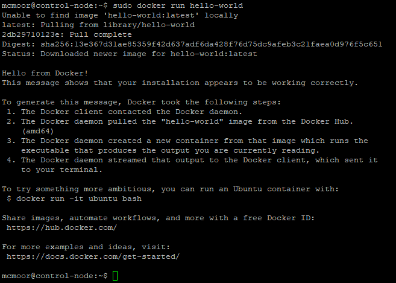
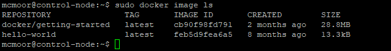
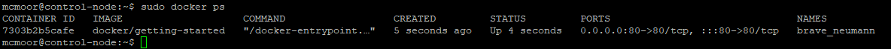
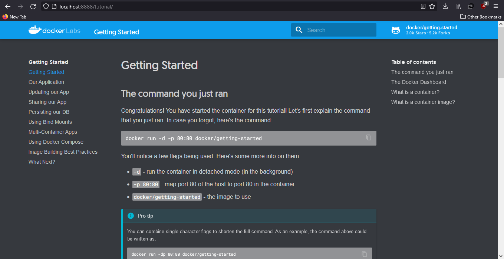
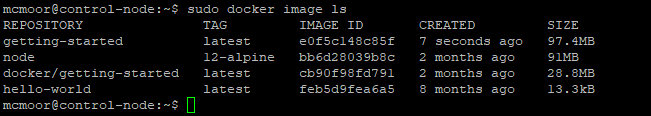
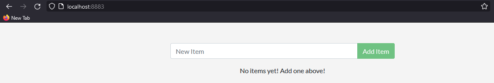
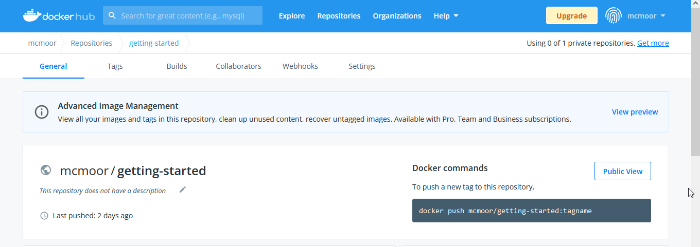

# Chapter 1: Docker

Docker adalah

## Part 0. Instalasi Docker

Dalam tahap ini dilakukan instalasi docker menggunakan repository. Langkah-langkah lengkap dapat dilihat dalam [link ini](https://docs.docker.com/engine/install/ubuntu/#install-using-the-repository).

Terlebih dahulu dilakukan update paling terbaru terhadp `apt` dan juga instalasi terhadap beberapa program lain yang akan dibutuhkan. Perintah untuk melakukan hal tersebut adalah sebagai berikut.

    $ sudo apt-get update
    $ sudo apt-get install \
        ca-certificates \
        curl \
        gnupg \
        lsb-release

Setelah itu, tambahkan kunci GPG resmi milik Docker

    $ sudo mkdir -p /etc/apt/keyrings
    $ curl -fsSL https://download.docker.com/linux/ubuntu/gpg | sudo gpg --dearmor -o /etc/apt/keyrings/docker.gpg

Dan kemudian perintah berikut untuk menambahkan repository yang dibutuhkan 

    $ echo \
        "deb [arch=$(dpkg --print-architecture) signed-by=/etc/apt/keyrings/docker.gpg] https://download.docker.com/linux/ubuntu \
        $(lsb_release -cs) stable" | sudo tee /etc/apt/sources.list.d/docker.list > /dev/null

Pada akhirnya, kita dapat benar-benar menginstall docker beserta beberapa program pendampingnya. Perintah untuk melakukan hal tersebut adalah sebagaimana berikut

    $ sudo apt-get update
    $ sudo apt-get install docker-ce docker-ce-cli containerd.io docker-compose-plugin

Untuk mengecek keberhasilan instalasi, dapat dilakukan perintah hello world Docker ini

    $ sudo docker run hello-world

Jika semua langkah sudah berhasil dilakukan, pembaca akan melihat hasil sebagaimana berikut



Selamat, anda sudah berhasil menginstall docker!

## Part 1. Pull Image from Registry

Setelah ini, apa yang dapat dilakukan dengan docker? Docker sudah menyediakan sebuah tutorial yang dapat diakses dengan menuliskan perintah

    $ sudo docker pull docker/getting-started

Perintah ini melakukan pull sebuah image yang sudah ada dalam repository **docker/getting-started**. Image ini berisi tutorial yang sudah disiapkan oleh docker. 

## Part 2. List Images

Pembaca dapat melihat image yang sudah dimiliki sejauh ini dengan melakukan perintah

    $ sudo docker image ls



Dapat terlihat bahwa image yang sudah ada adalah image **hello-world** yang diunduh untuk perintah `sudo docker run hello-world` yang dilakukan sebelumnya serta image **docker/getting-started** yang dipull dalam tahap sebelumnya.

## Part 3. Run a Container

Untuk mengeksekusi isi dari tutorial dalam **docker/getting-started**, dapat dilakukan perintah

    $ sudo docker run -dp 80:80 docker/getting-started

Perintah ini membuat sebuah container berisi web app dalam image docker/getting-started. Argumen `-d` membuat hal tersebu dilakukan dalam background dan argumen `-p` mengarahkan container tersebut untuk menggunakan port 80. 

## Part 4. List Container

Pembaca dapat melihat semua container yang sudah terbuat dengan melakukan perintah

    $ sudo docker ps

Hasil dari perintah tersebut jika container dalam perintah sebelumnya berhasil terbuat akan terlihat seperti ini



Karena port forwarding yang sudah dilakukan sebelumnya, sekarang pengguna dapat melihat web app tersebut dalam **localhost:8888** yang sudah ditentukan sebelumnya.



Selamat, anda sudah sukses mengunduh dan mengeksekusi sebuah image dari registry!

## Part 5. Create and Build Simple Custom Container using Dockerfile

Setelah mengunduh image yang sudah jadi dari repository, kini saatnya kita untuk membuat container kita sendiri. Docker Tutorial menyediakan sebuah web app sederhana (To-Do App) yang dapat dijadikan contoh untuk hal ini. Anda dapat melihat isi dari web app itu dalam [link ini](../resources/app/). Untuk mendapatkan app tersebut dalam mesin cloud yang kita miliki, dapat dilakukan perintah

    $ wget localhost:80/assets/app.zip
    $ sudo apt install unzip
    $ unzip app.zip
    $ cd app

Pembaca dalam melihat isi dari folder **app** untuk melihat seperti web app yang akan digunakan.

Didalam folder **app**, buat file bernama **Dockerfile** dan isi file tersebut sebagaimana berikut

```
FROM node:12-alpine
WORKDIR /app
COPY . .
RUN yarn install --production
CMD ["node", "src/index.js"]
```

Perintah dalam **Dockerfile** ini pertama berisi instruksi untuk menggunakan isi dari image dalam repository node:12-alpine untuk menjadi isi permulaan. Kemudian kita copy isi program dari folder **app** dan kita install requirement yang dibutuhkan dengan menggunakan `yarn`. Kemudian, ditetapkan perintah yang akan pertama dijalankan ketika container dieksekusi yaitu `node` untuk menyalakan NodeJS kemudian `src/index.js` yang merupakan homepage dari web app ini.

Untuk melakukan build container ini, dilakukan perintah

    $ sudo docker build -t getting-started .

Perintah ini melakukan build image bernama **getting-started** dengan menggunakan **Dockerfile** yang berada dalam folder ini. Hasil dari perintah ini dapat dilihat menggunakan perintah `sudo docker image ls` yang sudah disebutkan sebelumnya.



Pada akhirnya, kita dapat meluncurkan container berbasis dari image ini dengan melakukan perintah

    $ sudo docker run -dp 3000:3000 getting-started

Pada kesempatan ini, web app menggunakan port 3000 yang kita alikan ke **localhost:3000**. Dalam port forwarding sebelumnya, alamat tersebut kita sudah alihkan kembali ke **localhost:8883** dalam komputer pengguna sehingga pembaca dapat mengakses isi dari web app ini dalam **localhost:8883**



Selamat, anda sudah berhasil membuat dan mengeksekusi container buatan anda sendiri!

## Part Extra. Sharing Image

Untuk memudahkan eksplorasi selanjutnya, maka kita akan menggunakan image yang sudah dibuat dalam tahap ini untuk tahap-tahap selanjutnya. Untuk itu, kita harus mengunggah image ini ke repository docker. 

Terlebih dahulu, kita harus memiliki akun dalam [Docker Hub](https://hub.docker.com/) dan membuat repository bernama **getting-started**. Jangan lupa untuk membuat repository tersebut memiliki visibility **Public**. Repository yang sudah dibuat kurang lebih akan terlihat seperti ini.



Setelah itu, kita ubah nama image yang dimiliki dari **getting-started** menjadi **USER_NAME_ANDA/getting-started**. Ubah `USER_NAME_ANDA` menjadi nama username milik anda sendiri.

    $ sudo docker tag getting-started USER_NAME_ANDA/getting-started

Kemudian kita harus melakukan login ke Docker Hub melakukan perintah

    $ sudo docker login -u USER_NAME_ANDA

Pada akhirnya kita dapat melakukan `push` image kita ke repository tersebut dengan menuliskan perintah

    $ sudo docker push USER_NAME_ANDA/getting-started

Untuk tahap selanjutnya, kita dapat melakukan `pull` dari **USER_NAME_ANDA/getting-started** untuk langsung mendapatkan image yang sudah kita buat dalam tahap ini.

## Next, [Chapter 2 : Ansible](ansible.md)!