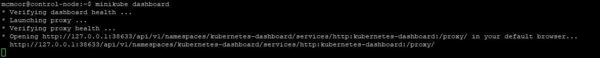
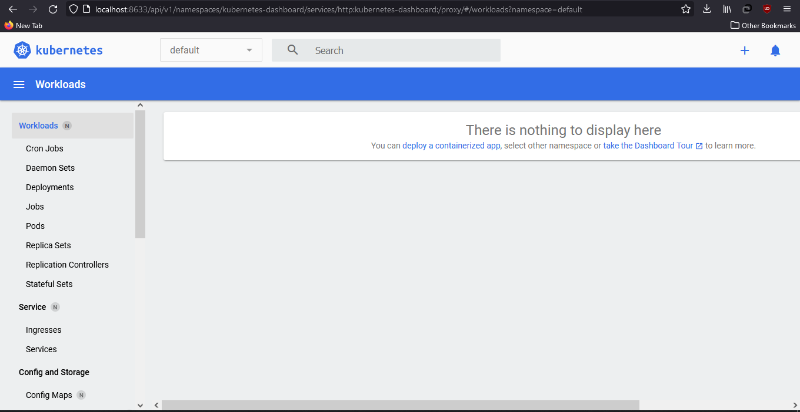
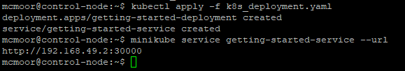
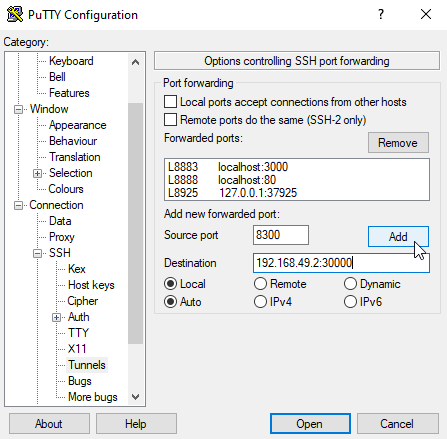
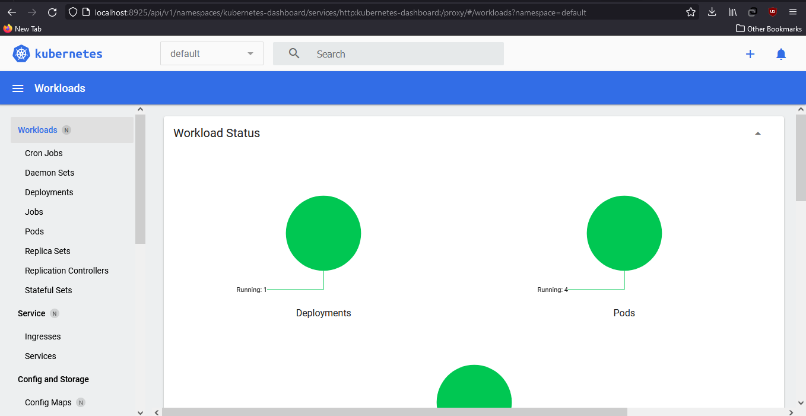
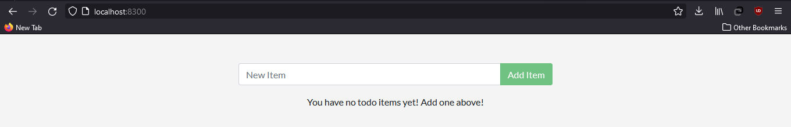
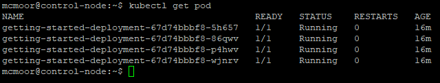
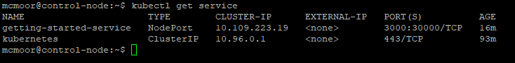

# Chapter 3 : Kubernetes

## Daftar Isi

* [Chapter 0 : Konfigurasi Mesin](articles/machine.md)
* [Chapter 1 : Docker](articles/docker.md)
* [Chapter 2 : Ansible](articles/ansible.md)
* [Chapter 3 : Kubernetes](articles/kubernetes.md) 
  
Kubernetes adalah sebuah sistem untuk yang dapat mengautomasi manajemen serta deployment dari `container`. Container yang dapat digunakan diantaranya adalah container milik docker yang sudah disebutkan sebelumnya. Misalnya jika docker container mengalami kegagalan, maka Kubernetes dapat mengusahakan agar container baru segera dibuat lagi. Kubernetes juga dapat membuat beberapa container indentik terpisah untuk menangani workload yang berlebih.

`Pod` adalah unit paling dasar dari Kubernetes. Pod berisi beberapa container yang dijamin berasa dalam satu node. Dapat dibuat beberapa pod untuk satu aplikasi untuk menangani workload. Kemudian dibuat `Deployment` yang akan mengatur pod-pod tersebut dan membuat dan menghapus pod jika dibutuhkan. Dengan kata lain, Deployment adalah tool yang bertugas untuk menjaga dan mengatur karakteristik dari pod yang ada. Pada akhirnya, ada `Service` yang bertugas untuk mengekspos dengan label selector tertentu ke port-port tertentu.

Pada artikel ini, kita akan mendeploy image docker yang sudah dibuat sebelumnya kedalam kubernetes. Operasi ini akan dilakukan mesin **Control Node** yang sudah dimiliki sebelumnya.

## Part 0. Install `minikube` dan `kubectl`

`minikube` adalah sebuah sebuah implementasi Kubernetes yang dapat membuat VM pada mesin lokal serta membuat sebuah cluster yang hanya berisi satu node. Hali ini membuat `minikube` sangat ideal untuk mempelajari Kubernetes dan berbagai operasinya dengan mudah.

Instalasi `minikube` membutuhkan docker yang dapat diakses oleh user tanpa perlu memerlukan sudo. Untuk itu, dapat dilakukan perintah berikut ini.

    $ sudo usermod -aG docker $USER
    $ newgrp docker

Kemudian anda dapat melakukan instalasi `minikube` dengan menggunakan perintah

    $ curl -LO https://storage.googleapis.com/minikube/releases/latest/minikube-linux-amd64
    $ sudo install minikube-linux-amd64 /usr/local/bin/minikube

Kemudian mulai cluster baru dengan menggunakan perintah

    $ minikube start

Anda dapat melakukan instalasi `kubectl` sekaligus melihat cluser yang baru dibuat dengan menggunakan perintah

    $ minikube kubectl -- get po -A

Untuk memudahkan penulisan perintah selanjutnya, dapat ditambahkan teks berikut ini dalam `~/.bashrc`

```
alias kubectl="minikube kubectl --"
```

Akhirnya anda dapat melihat berbagai hal tentang kubernetes yang sudah terinstall dengan melakukan perintah

    $ minikube dashboard



Anda dapat melakukan port forward ke port yang disebutkan dalam hasil tersebut.



## Part 1. Deployment menggunakan FIle YAML

Seperti pada Ansible, file YAML memungkinkan kita untuk melakukan perintah yang kompleks dan panjang dengan sangat mudah. Untuk sekarang kita akan mencoba mendeploy image getting-started ke dalam kubernetes. Karena aplikasi yang kita miliki `stateless`, maka kita tidak perlu membuat `volume` khusus untuk menyimpan data untuk aplikasi ini. Teks YAML yang dibutuhkan akan terlihat seperti ini

```
apiVersion: apps/v1
kind: Deployment
metadata:
  name: getting-started-deployment
  labels:
    app: GettingStartedApp
spec:
  replicas: 4
  selector:
    matchLabels:
      app: GettingStartedApp
  template:
    metadata:
      labels:
        app: GettingStartedApp
    spec:
      containers:
      - name: getting-started
        image: USER_NAME_ANDA/getting-started
        ports:
        - containerPort: 3000
          name: http-web-sv
```

Pada teks ini kita menyatakan bahwa kita akan membuat sebuah deployment bernama `getting-started-deployment`. Kita juga akan memberikan label yang akan digunakan seterusnya sebagai target yaitu `app: GettingStartedApp`. Kemudian kita menyatakan bahwa kita akan mebuat 4 pods sebagai ReplicaSet yang semuanya akan berisi container yang kita inginkan. Pada akhirnya kita nyatakan bahwa container yang kita inginkan akan didapatkan dari `USER_NAME_ANDA/getting_started` dan akan menggunakan port 3000. Port itu kita namakan `http-web-sv` sehingga dapat direferensi nantinya.

## Part 2. Service menggunakan File YAML

Kemudian kita akan membuat service untuk mengekspos Deployment yang sudah dibuat sebelumnya ke port tertentu. Untuk itu, maka file YAML tersebut dapat ditambahkan dengan teks berikut ini

```
---
apiVersion: v1
kind: Service
metadata:
  name: getting-started-service
  labels:
    app: GettingStartedApp
spec:
  type: NodePort
  selector:
    app: GettingStartedApp
  ports:
  - name: geting-started-service-port
    port: 3000
    targetPort: http-web-svc
    nodePort: 30000
```

Dalam teks ini kita mendeklarasikan bahwa kita akan membuat service bernama `getting-started-service`. Service ini akan mentarget entitas dengan label `app: GettingStartedApp`. Service ini akan menggunakan NodePort untuk mengekspos deplyoment tersebut ke dalam sebuah port statik. Biasanya kubernetes akan menetapkan sebuah port secara random diantara 30000-32767 namun pada kasus ini kita akan menetapkan port kita sendiri untuk memudahkan port forwarding. Port ini akan mengekspos port `http-web-svc` yang sudah disebut sebelumnya ke port 30000.

## Part 3. Eksekusi File YAML

Sekarang kita dapat mengeksekusi file YAML yang sudah dibuat. File YAML secara lengkap dapat dilihat pada [k8s_deployment.yaml](../resources/k8s_deployment.yaml). Untuk mengaplikasikan file ini, dilakukan perintah

    $ kubectl apply -f k8s_deployment.yaml

Kemudian untuk mengecek dimana alamat web app ini bisa dilihat, dapat dilakukan perintah

    $ minikube service getting-started-service --url

Jika semuanya sukses dilakukan maka hasil yang dapat dilihat akan menjadi sebagaimana berikut



Dapat terlihat bahwa webapp dapat diakses pada `http://192.168.49.2:30000`. Pembaca dapat melakukan port forwarding ke alamat ini untuk melihat web app yang sudah dideploy.



Setelah deployment ini, jendela dari kubernetes dashboard juga akan berubah.



Pembaca akhirnya dapat melihat webapp yang sudah dideploy ke kubernetes



Selamat, anda berhasil menggunakan Kubernetes untuk mendeploy sebuah aplikasi!

## Part 4. List Pods

Pembaca dapat melihat seluruh pod yang sudah dibuat selama ini dengan menggunakan perintah 

    $ kubectl get pod



Dapat terlihat bahwa sudah terbuat 4 buah pod yang semuanya dimiliki oleh development `getting-started-development`. ReplicaSet dibuat untuk memastikan bahwa selalu ada beberapa pod yang ditetapkan untuk menangani workload. Jika ada pod yang gagal, maka kubernetes langsung akan berusaha membuat pod baru untuk mengganti pod yang rusak tersebut.

## Part 5. List Service

Pembaca dapat melihat semua service yang sudah dibuat dengan menuliskan perintah

    $ kubectl get service



Dapat terlihat bahwa ada service bernama `getting-started-service` yang memiliki tipe `NodePort`. Service ini melakukan port forward dari port 3000 ke port 30000 yang dapat diakses di luar cluster.

## Penutup

Dengan demikian berakhir eksplorasi beberapa Cloud Tools yaitu Docker, Ansible, dan Kubernetes. Penulis berharap bahwa tulisan ini akan berharga bagi pembaca dan dapat menjadi langkah awal pembaca untuk melakukan eksplorasi lebih lanjut dan mendapatkan pengetahuan baru. Semoga sukses! :D

## Sumber dan Referensi Lebih Lanjut
* https://containerjournal.com/editorial-calendar/best-of-2021/kubernetes-pods-vs-deployments/
* https://docs.docker.com/engine/install/linux-postinstall/
* https://minikube.sigs.k8s.io/docs/start/
* https://kubernetes.io/docs/tasks/run-application/run-stateless-application-deployment/ 
* https://kubernetes.io/docs/concepts/cluster-administration/manage-deployment/
* https://kubernetes.io/docs/tutorials/stateless-application/expose-external-ip-address/
https://kubernetes.io/docs/concepts/services-networking/service/#type-nodeport
* https://stackoverflow.com/questions/40767164/expose-port-in-minikube
* https://minikube.sigs.k8s.io/docs/handbook/accessing/