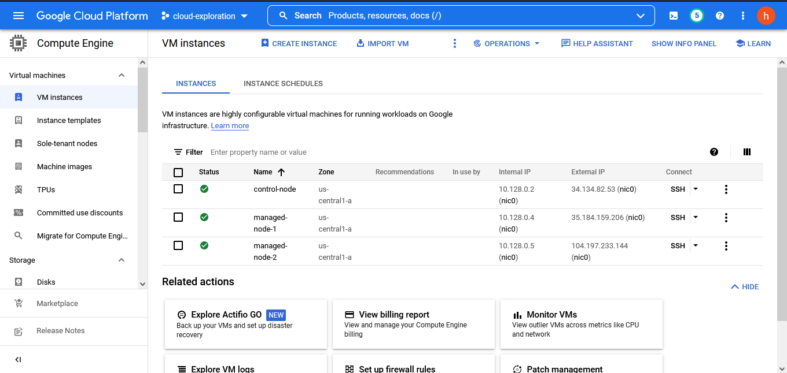

# Chapter 0 : Konfigurasi Mesin

Untuk memudahkan eksplorasi setelahnya, dibutuhkan beberapa mesin yang dapat digunakan untuk melakukan berbagai percobaan yang akan dilakukan. Untuk itu, penulis menggunakan beberapa mesin gratisan yang bisa disediakan oleh Google dalam Google Cloud Platform dengan memanfaatkan bonus dari [GCP Free Tier](https://cloud.google.com/free). Pembaca dapat menggunakan mesin dari tempat lain atau malah menggunakan mesin pribadi namun beberapa keunggulan dari menggunakan mesin dalam cloud diantaranya adalah minimnya kuota dan cepatnya internet yang dimiliki oleh mesin Google serta kemudahan untuk membuang dan mengunakan mesin lain jika terjadi kesalahan instalasi yang parah.

Jika pembaca sudah memiliki akun GCP dan membuat proyek baru, pembaca dapat membuka **Compute Engine > VM Instances** untuk membuat beberapa instansi VM baru.

Pada jendela ini pembaca dapat mengklik **Create Instances** untuk membuat beberapa VM baru.

Untuk kesempatan ini, penulis tidak mengubah setting apapun kecuali mengubah OS yang digunakan dari **Debian 11** menjadi **Ubuntu 20.04 LTS**. Untuk melakukan hal tersebut, pembaca dapat melihat dibawah bagian **Boot Disk** dan mengklik **Change**.

Setelah itu, pembaca dapat mengscroll ke bawah dan menekan tombol **Create** untuk membuat sebuah VM.

Dalam kesempatan ini, penulis membuat tiga buah VM masing-masing bernama **Control-Node**, **Managed-Node-1**, dan **Managed-Node-2**.

Perhatikan bagian External IP karena IP itu yang akan digunakan untuk melakukan koneksi terhadap VM-VM tersebut.

Untuk dapat melakukan koneksi, akan dilakukan SSH. Untuk itu pembaca harus memberikan public_key milik pembaca. Hal ini dapat dilakukan dengan melihat fitur **Metadata** di kiri atau jauh dibawah dari tulisan **Compute Engine**

Pembuatan mesin sudah selesai dilakukan. Sekarang sudah dapat dilakukan koneksi terhadap mesin-mesin tersebut dengan menggunakan SSH. Untuk itu, penulis menggunakan software PuTTY. Pembaca harus memberikan private key miliki pembaca dalam bagian **Connection > SSH > Auth **

Untuk memudahkan melihat hasil dari instalasi program dalam mesin dalam cloud, Port Forwarding merupakan sebuah fitur yang sangat berguna. Untuk melakukan itu, pembaca dapat melihat bagian **Connection > SSH > Tunnels** dalam PuTTY.

Dalam gambar tersebut, penulis mengarahkan **localhost:8883** dalam komputer penulis untuk bisa mengakses **localhost:3000** dalam mesin cloud. Selain itu juga ada port forwarding dari **localhost:8888** ke **localhost:80** yang sudah dilakukan. Dalam perjalanan sebelumnya akan ada beberapa port lain yang mungkin akan ingin diprojeksi ke komputer pembaca dan untuk itu pembaca dapat melakukan prosedur seperti ini juga. Penjelasan lebih lengkap dari fitur ini dapat dilihat dalam https://www.akadia.com/services/ssh_putty.html .

Setelah semua hal itu dilakukan, kita siap untuk melakukan koneksi. Cukup masukan IP target, dalam hal ini IP dari control-node, dan koneksi akan dilakukan!

Jika koneksi sudah berhasil dilakukan, maka pembaca akan mendapatkan layar seperti ini

Dengan demikian, kita berhasil mendapatkan kontrol terhadap sebuah mesin kosong yang dapat dimanipulasi berbagai macam. 

## Next, [Chapter 1 : Docker](docker.md)!